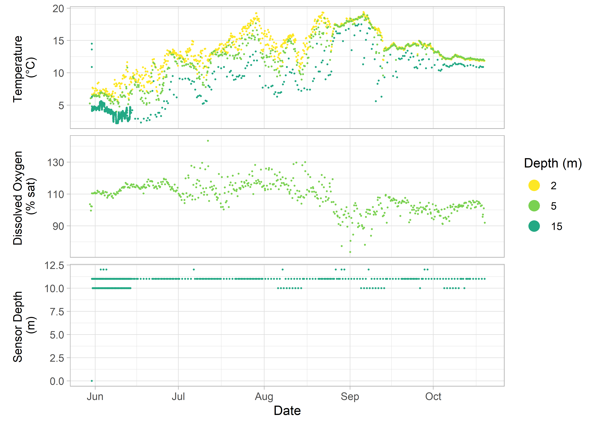

<!-- README.md is generated from README.Rmd. Please edit that file -->

# sensorstrings


<!-- badges: start -->

[](https://www.gnu.org/licenses/gpl-3.0)
[](https://github.com/dempsey-cmar/sensorstrings)
[](https://www.codefactor.io/repository/github/dempsey-cmar/sensorstrings)
[](https://github.com/dempsey-cmar/sensorstrings/actions)
[](https://app.codecov.io/gh/dempsey-CMAR/sensorstrings?branch=main)
<!-- badges: end -->

**This package replaces the
[strings](https://github.com/Centre-for-Marine-Applied-Research/strings)
package.**

New features:

-   Cleaner code
-   More straightforward workflow
    -   don’t need to export intermediate “raw” and “trim” files
    -   few arguments to specify in templates
-   Additional functions (e.g., `ss_download_data()`)
-   Variable names consistent with [Climate
    Forecast](https://cfconventions.org/) conventions
-   Formal tests
-   More helpful `Error` and `Warning` messages

Compile, format, and visualize Water Quality (temperature, dissolved
oxygen, salinity) data measured by different sensors.

## Installation

You can install the development version of `sensorstrings` from
[GitHub](https://github.com/) with:

``` r
# install.packages("devtools")
devtools::install_github("dempsey-CMAR/sensorstrings")
```

## Package Structure

The function at the tip calls the function at the tail.


## Background

The Centre for Marine Applied Research ([CMAR](https://cmar.ca/))
coordinates an extensive [Coastal Monitoring
Program](https://cmar.ca/coastal-monitoring-program/) to measure
[Essential Ocean
Variables](https://www.goosocean.org/index.php?option=com_content&view=article&id=14&Itemid=114)
from around the coast of Nova Scotia, Canada. There are three main
branches of the program: *Water Quality*, *Currents*, and *Waves*.
Processed data for each branch can be viewed and downloaded from several
sources, as outlined in the [CMAR Report & Data Access Cheat
Sheet](https://github.com/Centre-for-Marine-Applied-Research/strings/blob/master/man/figures/README-access-cheatsheet.pdf)
(download for clickable links).

The `sensorstrings` package is the backbone of the data pipeline for the
*Water Quality* branch of the Coastal Monitoring Program. It is used to
organize, compile, format, and visualize data *Water Quality* data.

*Water Quality* data (temperature, dissolved oxygen, and salinity) is
collected using “sensor strings”. Each sensor string is attached to the
seafloor by an anchor and suspended by a sub-surface buoy, with
autonomous sensors attached at various depths (Figure 1). A string
typically includes three sensor models: Hobo, aquaMeasure, and VR2AR
(Table 1). Strings are deployed at a station for several months and data
are measured every 1 minute to 1 hour, depending on the sensor.


Figure 1: Typical sensor string configuration (not to scale).

<br> <br>

After retrieval, data from each sensor is exported to a separate csv
file using manufacturer-specific software. Each type of sensor generates
a data file with unique columns and header fields, which poses a
significant challenge for compiling all data from a deployment into a
single format for analysis.

The `sensorstrings` package offers functions to compile, format, convert
units, and visualize sensor string data.

`sensorstrings` was developed specifically to streamline CMAR’s
workflow, but is flexible enough that other users can apply it to
process data from the accepted sensors (Table 1). **Vignettes to come**

| Sensor                                                                                                                           | Variable(s) Measured          |
|:---------------------------------------------------------------------------------------------------------------------------------|:------------------------------|
| [HOBO Pro V2](https://www.onsetcomp.com/datasheet/U22-001)                                                                       | Temperature                   |
| [HOBO DO](https://www.onsetcomp.com/datasheet/U26-001)                                                                           | Temperature, Dissolved Oxygen |
| [aquaMeasure DOT](https://www.innovasea.com/wp-content/uploads/2021/07/Innovasea-Aquaculture-Intelligence-Spec-Sheet-062221.pdf) | Temperature, Dissolved Oxygen |
| [aquaMeasure SAL](https://www.innovasea.com/wp-content/uploads/2021/07/Innovasea-Aquaculture-Intelligence-Spec-Sheet-062221.pdf) | Temperature, Salinity         |
| [VR2AR](https://www.innovasea.com/wp-content/uploads/2021/06/Innovasea-Fish-Tracking-vr2ar-data-sheet-0621.pdf)                  | Temperature                   |

For more information on *Water Quality* data collection and processing,
visit the [CMAR Water Quality Data Collection & Processing Cheat
Sheet](man/figures/README-workflow-cheatsheet.pdf) (download for
clickable links).

## Example

``` r
library(sensorstrings)
```

Consider a string deployed from May 31, 2019 to October 19, 2019 with
three sensors:

<table>
<thead>
<tr>
<th style="text-align:left;">
Sensor
</th>
<th style="text-align:center;">
Serial #
</th>
<th style="text-align:center;">
Depth
</th>
</tr>
</thead>
<tbody>
<tr>
<td style="text-align:left;">
HOBO Pro V2
</td>
<td style="text-align:center;">
10755220
</td>
<td style="text-align:center;">
2
</td>
</tr>
<tr>
<td style="text-align:left;">
aquaMeasure DOT
</td>
<td style="text-align:center;">
670364
</td>
<td style="text-align:center;">
5
</td>
</tr>
<tr>
<td style="text-align:left;">
VR2AR
</td>
<td style="text-align:center;">
547109
</td>
<td style="text-align:center;">
15
</td>
</tr>
</tbody>
</table>

### Raw data files

The data from each sensor is saved in separate csv file, each with
manufacturer-specific columns.

Import raw data files:

``` r
path <- system.file("extdata", package = "sensorstrings")

aquameasure_raw <- ss_read_aquameasure_data(
  path = paste0(path, "/aquameasure"), 
  file_name = "aquameasure-670364.csv"
)

hobo_raw <- ss_read_hobo_data(
  path = paste0(path, "/hobo"), 
  file_name = "10755220.csv"
)

vemco_raw <- ss_read_vemco_data(
  path = paste0(path, "/vemco"), 
  file_name = "vemco-547109.csv"
)
```

Examine the first rows of each raw data file:

#### AquaMeasure data

``` r
head(aquameasure_raw)
#>                       Timestamp(UTC) Time Corrected(seconds)             Sensor
#> 1  209s after startup (time not set)                      NA aquaMeasure-670364
#> 2  353s after startup (time not set)                      NA aquaMeasure-670364
#> 3 1226s after startup (time not set)                      NA aquaMeasure-670364
#> 4 2143s after startup (time not set)                      NA aquaMeasure-670364
#> 5 3006s after startup (time not set)                      NA aquaMeasure-670364
#> 6 3875s after startup (time not set)                      NA aquaMeasure-670364
#>        Record Type Dissolved Oxygen Temperature Device Tilt Battery Voltage
#> 1      Device Tilt               NA          NA        90.4              NA
#> 2      Temperature               NA       22.68          NA              NA
#> 3 Dissolved Oxygen            100.5          NA          NA              NA
#> 4      Device Tilt               NA          NA        91.0              NA
#> 5      Device Tilt               NA          NA        91.1              NA
#> 6 Dissolved Oxygen            100.5          NA          NA              NA
#>   TimeSet Time Text
#> 1      NA   NA   NA
#> 2      NA   NA   NA
#> 3      NA   NA   NA
#> 4      NA   NA   NA
#> 5      NA   NA   NA
#> 6      NA   NA   NA
```

#### Hobo data

``` r
head(hobo_raw)
#>    # Date Time, GMT+00:00 Temp, °C (LGR S/N: 10755220, SEN S/N: 10755220) V4
#> 1  4     2019-05-30 21:00                                           6.661 NA
#> 2  8      2019-05-31 1:00                                           7.695 NA
#> 3 12      2019-05-31 5:00                                           7.569 NA
#> 4 16      2019-05-31 9:00                                           6.509 NA
#> 5 20     2019-05-31 13:00                                           6.788 NA
#> 6 24     2019-05-31 17:00                                           6.839 NA
#>   Coupler Attached (LGR S/N: 10755220) Host Connected (LGR S/N: 10755220)
#> 1                                   NA                                 NA
#> 2                                   NA                                 NA
#> 3                                   NA                                 NA
#> 4                                   NA                                 NA
#> 5                                   NA                                 NA
#> 6                                   NA                                 NA
#>   Stopped (LGR S/N: 10755220) End Of File (LGR S/N: 10755220)
#> 1                                                            
#> 2                                                            
#> 3                                                            
#> 4                                                            
#> 5                                                            
#> 6
```

#### Vemco data

``` r
head(vemco_raw)
#>   Date and Time (UTC)     Receiver    Description  Data Units
#> 1    2019-05-30 18:06 VR2AR-547109          Noise 207.6    mV
#> 2    2019-05-30 18:10 VR2AR-547109     Tilt angle    89     °
#> 3    2019-05-30 18:13 VR2AR-547109    Temperature  13.6    °C
#> 4    2019-05-30 18:17 VR2AR-547109 Seawater depth     0     m
#> 5    2019-05-30 18:21 VR2AR-547109          Noise 178.3    mV
#> 6    2019-05-30 18:25 VR2AR-547109     Tilt angle    84     °
```

Data from each sensor is exported in a slightly different layout, making
it difficult to work with and analyze all of the data from a single
deployment.

### Compile and format with `sensorstrings`

The `ss_compile_deployment_data()` function makes it easy to compile
these files into a single data frame, with additional information added
from the deployment log.

#### Deployment Log

The deployment log includes the deployment and retrieval dates,
information on where the string was deployed, and the depth of each
sensor.

``` r
log <- ss_read_log(path)
#> v Reading from "STRING TRACKING".
#> v Range ''Area Info''.
```

``` r
log$deployment_dates
#>   start_date   end_date
#> 1 2019-05-31 2019-10-19
```

``` r
log$area_info
#>    county waterbody latitude longitude        station lease
#> 1 Halifax Shoal Bay 44.77241 -62.72608 Borgles Island    NA
```

``` r
log$sn_table
#> # A tibble: 3 x 3
#>   sensor          serial_number depth
#>   <chr>                   <dbl> <dbl>
#> 1 HOBO Pro V2          10755220     2
#> 2 aquaMeasure DOT        670364     5
#> 3 VR2AR                  547109    15
```

#### Compile Data

`ss_compile_deployment_data()` reads in the log and the data for each
sensor and exports a single data frame.

``` r
dat <- ss_compile_deployment_data(path)
#> v Reading from "STRING TRACKING".
#> v Range ''Area Info''.
#> aquaMeasure data compiled
#> HOBO data compiled
#> Vemco data compiled: Temperature

kable(dat[1:10, ])
```

<table>
<thead>
<tr>
<th style="text-align:left;">
county
</th>
<th style="text-align:left;">
waterbody
</th>
<th style="text-align:left;">
station
</th>
<th style="text-align:left;">
lease
</th>
<th style="text-align:right;">
latitude
</th>
<th style="text-align:right;">
longitude
</th>
<th style="text-align:left;">
deployment_range
</th>
<th style="text-align:left;">
sensor_type
</th>
<th style="text-align:right;">
sensor_serial_number
</th>
<th style="text-align:left;">
timestamp_utc
</th>
<th style="text-align:left;">
sensor_depth_at_low_tide_m
</th>
<th style="text-align:right;">
dissolved_oxygen_percent_saturation
</th>
<th style="text-align:right;">
sensor_depth_measured_m
</th>
<th style="text-align:right;">
temperature_degree_C
</th>
</tr>
</thead>
<tbody>
<tr>
<td style="text-align:left;">
Halifax
</td>
<td style="text-align:left;">
Shoal Bay
</td>
<td style="text-align:left;">
Borgles Island
</td>
<td style="text-align:left;">
NA
</td>
<td style="text-align:right;">
44.77241
</td>
<td style="text-align:right;">
-62.72608
</td>
<td style="text-align:left;">
2019-May-31 to 2019-Oct-19
</td>
<td style="text-align:left;">
hobo
</td>
<td style="text-align:right;">
10755220
</td>
<td style="text-align:left;">
2019-05-31 01:00:00
</td>
<td style="text-align:left;">
2
</td>
<td style="text-align:right;">
NA
</td>
<td style="text-align:right;">
NA
</td>
<td style="text-align:right;">
7.695
</td>
</tr>
<tr>
<td style="text-align:left;">
Halifax
</td>
<td style="text-align:left;">
Shoal Bay
</td>
<td style="text-align:left;">
Borgles Island
</td>
<td style="text-align:left;">
NA
</td>
<td style="text-align:right;">
44.77241
</td>
<td style="text-align:right;">
-62.72608
</td>
<td style="text-align:left;">
2019-May-31 to 2019-Oct-19
</td>
<td style="text-align:left;">
hobo
</td>
<td style="text-align:right;">
10755220
</td>
<td style="text-align:left;">
2019-05-31 05:00:00
</td>
<td style="text-align:left;">
2
</td>
<td style="text-align:right;">
NA
</td>
<td style="text-align:right;">
NA
</td>
<td style="text-align:right;">
7.569
</td>
</tr>
<tr>
<td style="text-align:left;">
Halifax
</td>
<td style="text-align:left;">
Shoal Bay
</td>
<td style="text-align:left;">
Borgles Island
</td>
<td style="text-align:left;">
NA
</td>
<td style="text-align:right;">
44.77241
</td>
<td style="text-align:right;">
-62.72608
</td>
<td style="text-align:left;">
2019-May-31 to 2019-Oct-19
</td>
<td style="text-align:left;">
hobo
</td>
<td style="text-align:right;">
10755220
</td>
<td style="text-align:left;">
2019-05-31 09:00:00
</td>
<td style="text-align:left;">
2
</td>
<td style="text-align:right;">
NA
</td>
<td style="text-align:right;">
NA
</td>
<td style="text-align:right;">
6.509
</td>
</tr>
<tr>
<td style="text-align:left;">
Halifax
</td>
<td style="text-align:left;">
Shoal Bay
</td>
<td style="text-align:left;">
Borgles Island
</td>
<td style="text-align:left;">
NA
</td>
<td style="text-align:right;">
44.77241
</td>
<td style="text-align:right;">
-62.72608
</td>
<td style="text-align:left;">
2019-May-31 to 2019-Oct-19
</td>
<td style="text-align:left;">
hobo
</td>
<td style="text-align:right;">
10755220
</td>
<td style="text-align:left;">
2019-05-31 13:00:00
</td>
<td style="text-align:left;">
2
</td>
<td style="text-align:right;">
NA
</td>
<td style="text-align:right;">
NA
</td>
<td style="text-align:right;">
6.788
</td>
</tr>
<tr>
<td style="text-align:left;">
Halifax
</td>
<td style="text-align:left;">
Shoal Bay
</td>
<td style="text-align:left;">
Borgles Island
</td>
<td style="text-align:left;">
NA
</td>
<td style="text-align:right;">
44.77241
</td>
<td style="text-align:right;">
-62.72608
</td>
<td style="text-align:left;">
2019-May-31 to 2019-Oct-19
</td>
<td style="text-align:left;">
hobo
</td>
<td style="text-align:right;">
10755220
</td>
<td style="text-align:left;">
2019-05-31 17:00:00
</td>
<td style="text-align:left;">
2
</td>
<td style="text-align:right;">
NA
</td>
<td style="text-align:right;">
NA
</td>
<td style="text-align:right;">
6.839
</td>
</tr>
<tr>
<td style="text-align:left;">
Halifax
</td>
<td style="text-align:left;">
Shoal Bay
</td>
<td style="text-align:left;">
Borgles Island
</td>
<td style="text-align:left;">
NA
</td>
<td style="text-align:right;">
44.77241
</td>
<td style="text-align:right;">
-62.72608
</td>
<td style="text-align:left;">
2019-May-31 to 2019-Oct-19
</td>
<td style="text-align:left;">
hobo
</td>
<td style="text-align:right;">
10755220
</td>
<td style="text-align:left;">
2019-05-31 21:00:00
</td>
<td style="text-align:left;">
2
</td>
<td style="text-align:right;">
NA
</td>
<td style="text-align:right;">
NA
</td>
<td style="text-align:right;">
7.192
</td>
</tr>
<tr>
<td style="text-align:left;">
Halifax
</td>
<td style="text-align:left;">
Shoal Bay
</td>
<td style="text-align:left;">
Borgles Island
</td>
<td style="text-align:left;">
NA
</td>
<td style="text-align:right;">
44.77241
</td>
<td style="text-align:right;">
-62.72608
</td>
<td style="text-align:left;">
2019-May-31 to 2019-Oct-19
</td>
<td style="text-align:left;">
hobo
</td>
<td style="text-align:right;">
10755220
</td>
<td style="text-align:left;">
2019-06-01 01:00:00
</td>
<td style="text-align:left;">
2
</td>
<td style="text-align:right;">
NA
</td>
<td style="text-align:right;">
NA
</td>
<td style="text-align:right;">
7.594
</td>
</tr>
<tr>
<td style="text-align:left;">
Halifax
</td>
<td style="text-align:left;">
Shoal Bay
</td>
<td style="text-align:left;">
Borgles Island
</td>
<td style="text-align:left;">
NA
</td>
<td style="text-align:right;">
44.77241
</td>
<td style="text-align:right;">
-62.72608
</td>
<td style="text-align:left;">
2019-May-31 to 2019-Oct-19
</td>
<td style="text-align:left;">
hobo
</td>
<td style="text-align:right;">
10755220
</td>
<td style="text-align:left;">
2019-06-01 05:00:00
</td>
<td style="text-align:left;">
2
</td>
<td style="text-align:right;">
NA
</td>
<td style="text-align:right;">
NA
</td>
<td style="text-align:right;">
7.544
</td>
</tr>
<tr>
<td style="text-align:left;">
Halifax
</td>
<td style="text-align:left;">
Shoal Bay
</td>
<td style="text-align:left;">
Borgles Island
</td>
<td style="text-align:left;">
NA
</td>
<td style="text-align:right;">
44.77241
</td>
<td style="text-align:right;">
-62.72608
</td>
<td style="text-align:left;">
2019-May-31 to 2019-Oct-19
</td>
<td style="text-align:left;">
hobo
</td>
<td style="text-align:right;">
10755220
</td>
<td style="text-align:left;">
2019-06-01 09:00:00
</td>
<td style="text-align:left;">
2
</td>
<td style="text-align:right;">
NA
</td>
<td style="text-align:right;">
NA
</td>
<td style="text-align:right;">
6.661
</td>
</tr>
<tr>
<td style="text-align:left;">
Halifax
</td>
<td style="text-align:left;">
Shoal Bay
</td>
<td style="text-align:left;">
Borgles Island
</td>
<td style="text-align:left;">
NA
</td>
<td style="text-align:right;">
44.77241
</td>
<td style="text-align:right;">
-62.72608
</td>
<td style="text-align:left;">
2019-May-31 to 2019-Oct-19
</td>
<td style="text-align:left;">
hobo
</td>
<td style="text-align:right;">
10755220
</td>
<td style="text-align:left;">
2019-06-01 13:00:00
</td>
<td style="text-align:left;">
2
</td>
<td style="text-align:right;">
NA
</td>
<td style="text-align:right;">
NA
</td>
<td style="text-align:right;">
7.242
</td>
</tr>
</tbody>
</table>

### Plot

``` r
ss_plot_variables_at_depth(dat)
```


